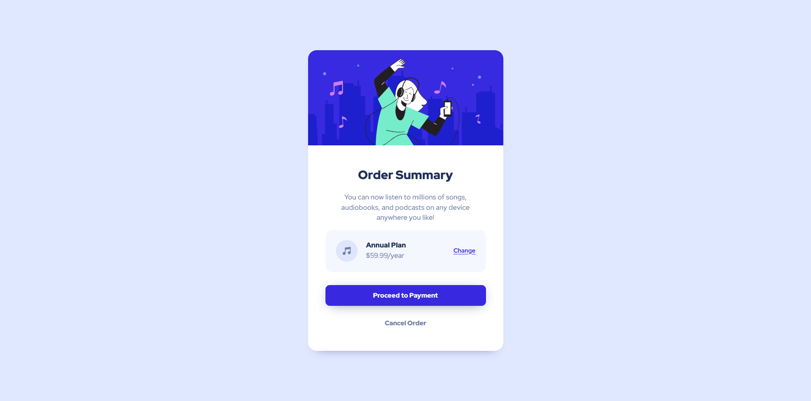
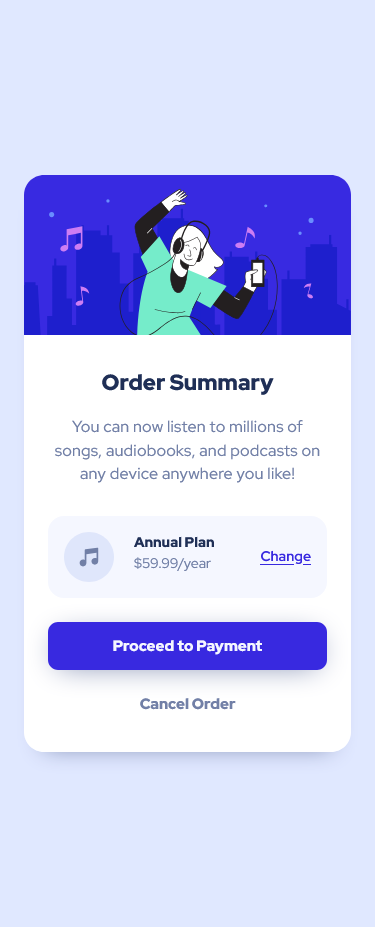

# Frontend Mentor - Recipe page solution

This is a solution to the [Recipe page challenge on Frontend Mentor](https://www.frontendmentor.io/challenges/recipe-page-KiTsR8QQKm). Frontend Mentor challenges help you improve your coding skills by building realistic projects. 

## Table of contents

- [Overview](#overview)
  - [The challenge](#the-challenge)
  - [Screenshot](#screenshot)
  - [Links](#links)
- [My process](#my-process)
  - [Built with](#built-with)
  - [What I learned](#what-i-learned)
  - [Continued development](#continued-development)
  - [Useful resources](#useful-resources)
- [Author](#author)

## Overview

### Screenshot




### Links

- Solution URL: (https://github.com/dansuda/order-summary-component)
- Live Site URL: (https://dansuda.github.io/order-summary-component)

## My process

### Built with

- Semantic HTML5 markup
- CSS custom properties
- Flexbox
- SASS/SCSS [https://sass-lang.com/]

### What I learned

This was a really heavy challenge compareed to previous ones by a distance. I learnt a lot of css and how flexible css really is.

I learnt again that my design has to be responsive and how I can use ```@media``` queries for that.

I learnt about how to make my design more responsive with less code by using percentages for widths and heights of images and containers, and also use of max-widths and max-heights.


### Continued development

I think I'd have to do more and more projects to truly continue to grow in my abilities and be comfortable with html and css code so I can now go into javascript.


### Useful resources

- (https://www.w3schools.com) - This helped me to understand how to use various css rules and how important they are. 
- (https://www.stackoverflow.com) - This is an amazing website which has really old questions but are still relevant to people like me today who seem to have joined this bandwagon very late. It's nice and helpful they've been around for so long.

## Author

- Github - [dansuda](https://www.github.com/dansuda)
- Frontend Mentor - [@dansuda](https://www.frontendmentor.io/profile/dansuda)